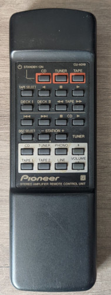

# Pioneer A-209R

Brand: Pioneer  
Model: A-209R  
Remote Model: CU-A019  
Type: Audio amplifier

Battery: 2x AA 1.5V

## Codes

- Uses [NEC2 Protocol](https://www.sbprojects.net/knowledge/ir/nec.php) code.
- May confuse with Anthem.
- Parameters:
  - Tape: Device=161
  - CD: Device=162
  - Tuner: Device=164
  - Amplifier: Device=165

See files in folder to get codes.
