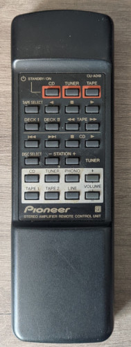

# Pioneer

Brand: Pioneer  
Model: 
Type: Audio

Battery: 2x AA 1.5V

## Codes

- Uses [Anthem Protocol](http://www.hifi-remote.com/johnsfine/DecodeIR.html#Anthem) code, which is "similar" to NEC1.
- Parameters: Device=161-165 SubDevice=90-94
- Has several different parameters 
- Code needs to repeat at least 3 times.

See files in folder to get codes.
