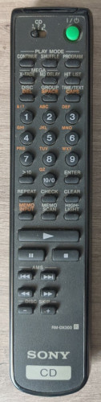

# Sony RM-DX300

Brand: Sony  
Model: RM-DX300  
Type: Jukebox CD

Battery: 2x AAA 1.5V

## Codes

- Uses [Sony12 Protocol](http://www.hifi-remote.com/johnsfine/DecodeIR.html#Sony12) code.
- When switching to CD 2 or CD 3, uses [Sony15 Protocol](http://www.hifi-remote.com/johnsfine/DecodeIR.html#Sony15) code.
- Parameters:
  - CD 1: Sony12 Device=17
  - CD 2: Sony15 Device=57
  - CD 3: Sony15 Device=81

See files in folder to get codes.
