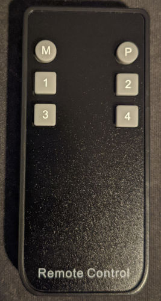

# TESmart KVM Switch HDMI

Brand: TESmart  
Model: TSL-HKS0401A1U-BK  
Type: KVM

Battery: CR2032 / CR2025

## Codes

- Uses [NEC1 Protocol](https://www.sbprojects.net/knowledge/ir/nec.php) code.
- Parameters: Device=23

See files in folder to get codes.
