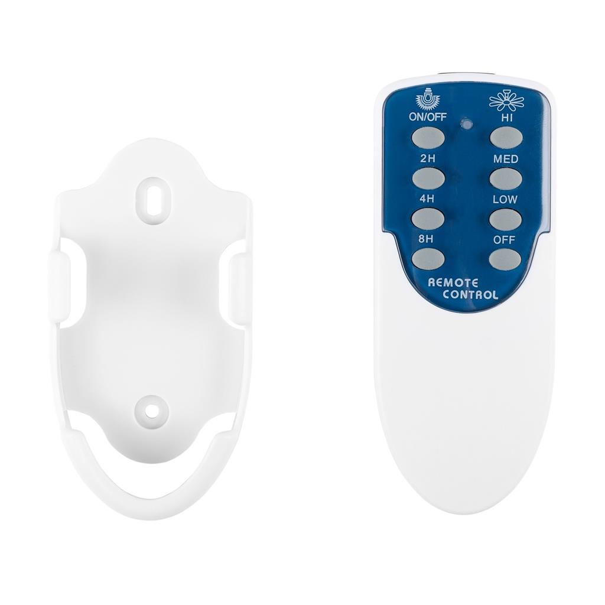
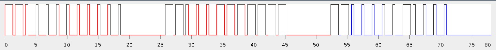

# Tristar VE-5817

Brand: Tristar  
Model: VE-5817  
Manufacturer: Xin Hui A.A. Electronics & Toys LTD.  
Type: Ceiling Fan  

Battery: 2x AAA 1.5V



## Codes



- 8 buttons
- Each button has 2 parts of init, the third is the repeating one
- Requires to repeat at least 6 times for optimal working

### Broadlink base64 format

```json
{
  "light": "JgDaACgPKA8NKg0pDikOKQ4pDikNKg0qDSoN6CgOKA8NKg0qDSonECcPKA8nECcQJxAn1ykOKA8NKg0qDSoNKg0qDSonEA0pDikO5ygPKA8NKg0qDSkOKQ4pDikoDw0qDSoN6CcQJw8NKg4pDikOKQ0qDSonEA0qDSkO5ygPKA8NKg0qDSoNKg0qDSonDw0qDikO5ygPKA8NKg0pDikOKQ4pDikoDw0qDSoN6CcQJw8NKg4pDikNKg0qDSonEA0pDikO8ikOJw8NKg4pDikOKQ0qDSonEA0qDSoNAA0FAAAAAAAAAAAAAAAA",
  "fan high": "JgDYACcQDSkOKQ4pDikOKQ4pDikNKg0qDfIqDicQDSkOKQ4pKA8oDycQJxAnDygPKNgoDigPDSoNKg0qDSoNKg0qDSoNKQ4pKNgpDicPDSoOKQ4pDSoNKg0qDSoNKg0qJ9gpDicPDSoOKQ4pDikNKg0qDSoNKg0qJ9gpDicPDSoOKQ4pDikOKQ4pDSoNKg0qJ9gpDicQDSkOKQ4pDikOKQ4pDikNKg4pJ9gpDicQDSkOKQ4pDikOKQ4pDikOKQ0qKNcpDicQDSoNKQ4pDikOKQ4pDikOKQ4pKAANBQAAAAAAAAAAAAAAAAAA",
  "fan low": "JgAKASkOJxANKQ4pDikOKQ4pDikOKQ0qDSoN8ygPKA8NKg0qDSkoDykOKA8oDygPKA4p1ygOKQ4NKg0qDSonEA0qDSoNKQ4qJw8o2CgOKA8NKg0qDSonEA0pDikOKQ4pKA8o1ykOJxANKg0qDSonDw4pDikOKQ4pKA8o1ioOKA8NKg0qDSonDw0qDikOKQ4pKA8n2CkOJxANKg0qDSonEA0pDikOKQ4pKA8n2CkOKA8NKg0qDSonEA0pDikOKQ4pKA8o2CgOKA8NKg0qDSonEA0qDSkOKQ4pKA8o2CkNKQ4NKg4pDSonEA0qDSoNKg0qJxAn2CkOJw8NKg4pDikoDw0qDSoNKg0qJxAnAA0FAAAAAAAAAAAAAAAA",
  "fan med": "JgAKASgPKQ4NKg0qDSoNKg0qDSkOKQ4pDikO8ikOKA8NKg0qDSonECcQJw8oDycQJxAn2CkOJw8NKg4pDikOKQ4pDSoOKSgPDSoN8ikOJxANKg0qDSoNKg0pDikOKSgPDSoO8ikNKA8NKg0qDSoNKg0qDSoNKicQDSkO8ikOJxANKQ4pDikOKQ4pDikOKSgPDSoN8ikOJxANKg0qDSoNKg0pDikOKicPDSoO8ikNKA8NKg0qDSoNKg0qDSoNKicQDSkO8ikOJxANKQ4pDikOKQ4pDikOKSgPDSoN8ikOJxANKg0qDSoNKg0pDikOKSgPDSoO8ikNKQ4NKg4pDSoNKg0qDSoNKicQDSkOAA0FAAAAAAAAAAAAAAAA",
  "fan off": "JgAiASgOKA8NKg0pDikOKQ4pDikOKQ4pDikN8ygPKA8NKg0qDSonECgOKQ4oDygPKA4p1yoOJw8NKg4pDikOKQ0qJxANKg0qDSkO8ygPJw8OKQ4pDikOKQ4pKA8NKg0qDSoN8ykOKA8NKg0qDSoNKg0qJw8NKg4pDikO8ikOKA8NKg0qDSoNKg0qJxANKg0qDSkO8ygPJw8NKg4pDikOKQ4pKA8NKg0qDSoN8ykOKA8NKg0pDikOKQ4pKA8NKg0qDSoN8ykOKA8NKg0qDSoNKg0qJxANKQ4pDikO8ikPJw8NKg4pDikOKQ0qKA8NKg0qDSoN8ykOJxANKQ4pDikOKQ4pKA8NKg0qDSoN8ygOJxANKg0qDSoNKg0qJw8NKg4pDikOAA0FAAAAAA==",
  "timer 2h": "JgDyACkOJw8OKQ4pDikOKQ4pDikOKQ0qDSoN6CkOKA4NKg4pDikoDygPKA8oDygOKQ4o1ykOKA8NKg0qDSoNKicQDSkOKQ4pDikO5ygPKA8NKg0qDSoNKicQDSkOKg0pDikO6CcPKQ4NKg0qDSoNKicQDSoNKQ4qDSkO6CcPKA8NKg0qDSoNKicQDSoNKg0pDioN6CcPKA8NKg4pDikOKSgPDSoNKg0qDSoN6CcQKA4NKg4pDikOKSgPDSoNKg0qDSoN6CgPJxANKQ4pDikOKSgPDSoOKQ4pDikO8ikNKA8NKg0qDSoNKicQDSoNKg0qDSoNAA0FAAAAAA==",
  "timer 4h": "JgDyACgOKA8NKg0qDSoNKg0qDSoNKg0qDSkO8ycQJxANKQ4pDikoDygPJxAnECcPKA8o2CkOKA8NKg0qDSonEA0qDSoNKSgPKQ4N8ykOKA8NKg4pDikoDw0qDSoNKicQJw8N8yoOJw8NKg4pDikoDw0qDSoNKigPJxAN8ykOKA8NKg0pDikoDw0qDikOKSgPKA8N8ygPJxANKg0qDSonEA0pDikOKSgPKA8N8ykOKA8NKg0qDSonEA0qDSoNKicQJw8N8isNKQ4NKg4pDikoDw0qDSoNKicQKA4N8ykOKA4NKg4pDikoDw0qDSoOKSgPKA8NAA0FAAAAAA==",
  "timer 8h": "JgDaACcQJw8NKg4pDikOKQ0qDSoNKg0qDSoN8ygPJxANKg0qDSonECcPKA8oDycQJxAn2CoOKA4NKg4pDikOKQ4pDikOKQ4pKA8N8ykOJxANKg0qDSoNKg0pDikOKQ4pKA8N8ykOKA8NKg0qDSoNKg0qDSoNKg0qJxAN8CwOKA4NKg4pDikOKQ4pDikNKg4pKA8N8ykOJxANKg0qDSoNKg0pDikOKQ4pKA8N8ykOKA8NKg0qDSoNKg0qDSoNKg0qJxAN8ikOJxANKQ4pDikOKQ4pDikOKQ4pJxANAA0FAAAAAAAAAAAAAAAA"
}
```

### Pronto

**Light ON/OFF**

```
0000 0073 0018 000C 002E 000F 002E 000F 000F 002E 000F 002E 000F 002E 000F 002E 000F 002E 000F 002E 000F 002E 000F 002E 000F 002E 000F 00FD
002E 000F 002E 000F 000F 002E 000F 002E 000F 002E 002E 000F 002E 000F 002E 000F 002E 000F 002E 000F 002E 000F 002E 00FD 002E 000F 002E 000F
000F 002E 000F 002E 000F 002E 000F 002E 000F 002E 000F 002E 002E 000F 000F 002E 000F 002E 000F 00FD
```
